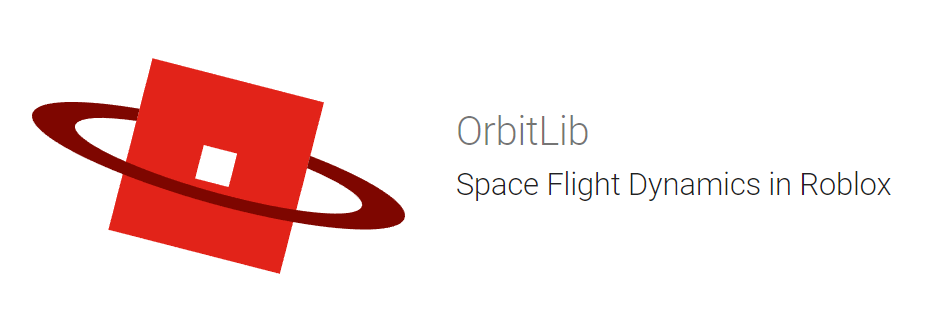

  

OrbitLib is the first public two-body Keplerian orbital mechanics library for Roblox Luau.

## [Documentation](https://orbitlib.owenbartolf.com/)

## License

OrbitLib is published under GNU Affero General Public License v3. See the included [license](license.md) for terms and conditions of use.