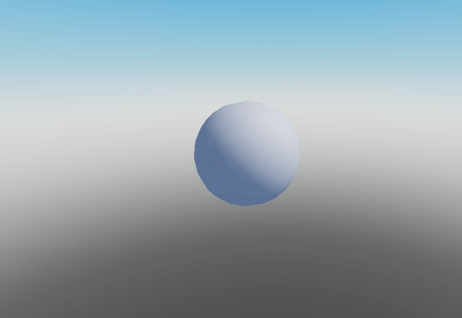
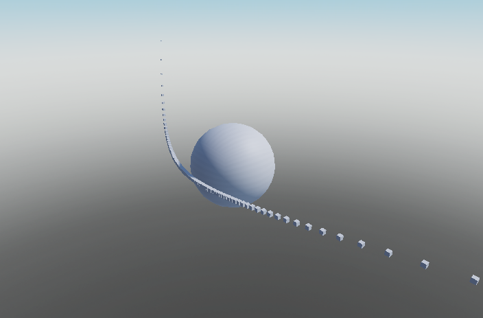
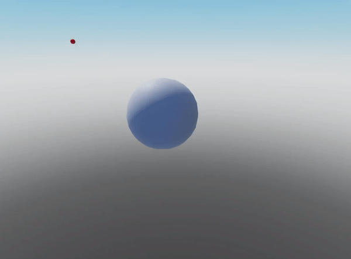

# Building a Basic Renderer

As per the [Design Notes](../designNotes.md), OrbitLib does not ship with an offical rendering library. However, many users expressed interest in seeing an example of rendering OrbitLib objects in the Roblox Workspace. This article will provide a set of functions for doing so.

## Conversions 

Before using OrbitLib values, some common-sense conversions must be made.

### OrbitLib and Roblox Reference Vectors

<center>
{ width=75% }
</center>

As per the [Design Notes](../designNotes.md), the reference vector directions between Roblox and OrbitLib are different. if we use OrbitLib coordinates without converting, we will find that our entire scene will have an undesired rotation of 90 degrees. Before we display OrbitLib coordinates in Roblox instances, always be sure to run the following conversions:

```lua title="Conversion Examples"
-- Convert from Roblox coordinates to OrbitLib coordinates.
function RobloxToOrbitLib(x: number, y: number, z: number)
    return x, -z, y
end

-- Convert from OrbitLib coordinates to Roblox Coordinates.
function OrbitLibToRoblox(i: number, j: number, k: number)
    return i, k, -j
end
```

### Studs and Kilometers

As we are rendering in Roblox, we will want to decide a scale at which we will render OrbitLib objects. Let's define a conversion factor between Roblox Studs and kilometers.

```lua title="Converting Between Studs and Kilometers"
-- Conversion factors
local oneStudEqualsKilometers = 1000
local oneKilometerEqualsStuds = 1/oneStudEqualsKilometers
```

In more advanced renderers, the bonus of using a unit conversion like the one above is that a zoom feature can be implemented easily. In the [WebGL Demo](../demo.md), zoom is implemented by changing the scale and re-rendering the scene every time the user moves the mouse wheel.

## Rendering a CelestialBody

We can render a celestial body as a sphere with its given radius.

```lua title="Render CelestialBody" linenums="1"
-- Renders the CelestialBody as a part.
function RenderCelestialBodyAsPart(celestialBody)
    
    -- Calculate radius and then convert to studs.
    local diameterStuds = (celestialBody.radius * 2) * oneKilometerEqualsStuds

    -- Create part to match
    local part = Instance.new("Part")
    part.Anchored = true
    part.Name = celestialBody.name
    part.Shape = Enum.PartType.Ball
    part.Size = Vector3.new(diameterStuds, diameterStuds, diameterStuds)
    part.TopSurface = Enum.SurfaceType.Smooth
    part.BottomSurface = Enum.SurfaceType.Smooth
    part.Position = Vector3.new(0,0,0)
    
    -- OPTIONAL: Uncomment the below line to have the function itself move
    -- the new part into the workspace.
    -- part.Parent = game.Workspace

    return part

end

```

Here is an example of Earth rendered in an empty Roblox place with `oneKilometerEqualsStuds = 1000`.



## Tracing Orbits

One way of visualizing orbits is to "trace" them mathematically. Orbits are polar functions, which means they take an angle as an argument. If we take a bunch of samples between some start and end angle, we will "trace" an arc of the orbit as it goes around the parent body.

The following function provides an implementation of this strategy. It takes a start angle (:material-ruler: rad) and end angle (:material-ruler: rad), and traces `segmentCount` points between the start and end angle along the path of the orbit. It also creates a part at each sampled point and returns the table of them.

```lua title="TraceOrbitArc" linenums="1"
--[[
	Traces the orbit between the startAngle and endAngle, creating segmentCount samples.
--]]
function TraceOrbitArc(orbit: table, startAngle: number, endAngle: number, segmentCount: number)

	local partsCreated = table.create(segmentCount)

	-- Take segmentCount samples along the orbit between [startAngle, endAngle]
	local segmentIndex = 0
	local increment = (endAngle - startAngle) / segmentCount
	for i=startAngle, endAngle, increment do
		
		-- Get position
		local x, y, z = orbit:GetPositionVelocityECI(i)
		x, y, z = RobloxToOrbitLib(x, y, z) -- Convert OrbitLab to Roblox
		x = x * oneKilometerEqualsStuds -- Convert from kilometers to Roblox studs.
		y = y * oneKilometerEqualsStuds
		z = z * oneKilometerEqualsStuds
		
		local samplePart = Instance.new("Part")
		samplePart.Anchored = true
		samplePart.Size = Vector3.new(0.5, 0.5, 0.5)
		samplePart.Name = "Sample"
		samplePart.Position = Vector3.new(x,y,z)
        samplePart.TopSurface = Enum.SurfaceType.Smooth
        samplePart.BottomSurface = Enum.SurfaceType.Smooth
		samplePart.Parent = game.Workspace
		partsCreated[segmentIndex] = 0
		segmentIndex += 1

	end

	return partsCreated

end
```

### Tracing Elliptical Orbits

To trace elliptical orbits, we want to sample the entire curve.

There are points 2π radians in a circle. This means that if we set a start angle of 0 radians, and an end angle of 2π radians, we will trace the entire path of the orbit.


### Tracing Hyperbolic Orbits

Hyperbolic orbits represent a special case. If one traces a hyperbola between 0 radians and 2π radians, they will discover that the hyperbola has two distinct parts.

We only want to trace the part of the hyperbola that is closest to the planet because this is represents the actual trajectory. To only trace this part of the hyperbola, we can solve for the asymptotes of the trajectory equation.


Skipping the derivation, we get that that range of the relevant part of the hyperbola is `-arccos(-(1/eccentricity)) < Θ < arccos(-(1/eccentricity))`.



### Putting It Together

We can use the orbit's [`Orbit.conic`](../API Reference/orbit/#string-conic) field to find out whether the orbit is elliptical or hyperbolic. Using this field, we can write a general function that selects the right way to trace the orbit like so:

```lua title="TraceOrbitArc and TraceOrbit" linenums="1"

--[[
    Traces the orbit between the startAngle and endAngle, creating segmentCount samples.
--]]
function TraceOrbitArc(orbit: table, startAngle: number, endAngle: number, segmentCount: number)

    local partsCreated = table.create(segmentCount)

    -- Take segmentCount samples along the orbit between [startAngle, endAngle]
    local segmentIndex = 0
    local increment = (endAngle - startAngle) / segmentCount
    for i=startAngle, endAngle, increment do

        -- Get position
        local x, y, z = orbit:GetPositionVelocityECI(i)
        x, y, z = RobloxToOrbitLib(x, y, z) -- Convert OrbitLab to Roblox
        x = x * oneKilometerEqualsStuds -- Convert from kilometers to Roblox studs.
        y = y * oneKilometerEqualsStuds
        z = z * oneKilometerEqualsStuds

        local samplePart = Instance.new("Part")
        samplePart.Anchored = true
        samplePart.Size = Vector3.new(0.5, 0.5, 0.5)
        samplePart.Name = "Sample"
        samplePart.Position = Vector3.new(x,y,z)
        samplePart.Parent = game.Workspace
        partsCreated[segmentIndex] = 0
        segmentIndex += 1

    end

    return partsCreated

end

-- Traces the given orbit with the number of segments.
function TraceOrbit(orbit: table, segmentCount: number)
	
	if orbit.conic ~= "HYPERBOLA" then
		TraceOrbitArc(orbit, 0, 2 * math.pi, segmentCount)
	else
		local asymptote = math.acos(-(1/orbit.eccentricity))
		TraceOrbitArc(orbit, -asymptote, asymptote, segmentCount)
	end
	
end
```

## Rendering Orbital Motion

Because spacecraft motion on large scales is a very slow process, let's first define a variable called `timeAcceleration` that represents how many times faster than realtime our simulation will process. Let's also define `currentTime` to be equal to zero; this will be our "clock" variable that stores the current time of the simulation.



Using a simple Heartbeat loop that repositions a part, we can increment time by the step time times our time acceleration. Then, we can calculate the predicted position of the spacecraft using OrbitLib's [Orbital Prediction](./orbitalPrediction.md) functions and set the part's position accordingly.

A script that does this is below.

```lua title="Rendered Spacecraft Moving" linenums="1"
-- Import OrbitLib
local CelestialBody = require(game.ReplicatedStorage.OrbitLib.CelestialBody)
local Orbit = require(game.ReplicatedStorage.OrbitLib.Orbit)

-- Convert from Roblox coordinates to OrbitLib coordinates.
function RobloxToOrbitLib(x: number, y: number, z: number)
	return x, -z, y
end

-- Convert from OrbitLib coordinates to Roblox Coordinates.
function OrbitLibToRoblox(i: number, j: number, k: number)
	return i, k, -j
end

-- Conversion Factors
local oneStudEqualsKilometers = 1000
local oneKilometerEqualsStuds = 1/oneStudEqualsKilometers


-- Time Values
local timeAcceleration = 10000 -- How many times normal speed
local currentTime = 0

-- Prediction constants
local TOLERANCE = 0.0008 -- A constant used for calculating precision of prediction
                         -- See Orbital Prediction for documentation.

-- Parent body and orbit
local earth = CelestialBody.new("Earth", 5.972e24, 6378.1)
local orbit = Orbit.fromKeplerianElements(
	earth, 0.3, 22000, 1, 0, 0, 0, 0
)

-- Makes a part to show the spacecraft's position.
function CreateSpacecraftPart()
	
	-- Create part to match
	local part = Instance.new("Part")
	part.Anchored = true
	part.Color = Color3.new(1,0,0)
	part.Name = "Spacecraft"
	part.Size = Vector3.new(1, 1, 1)
	part.Shape = Enum.PartType.Ball
	part.TopSurface = Enum.SurfaceType.Smooth
	part.BottomSurface = Enum.SurfaceType.Smooth
	part.Position = Vector3.new(0,0,0)
	part.Parent = game.Workspace
	
	return part
	
end

-- Part for spacecraft
local spacecraftPart = CreateSpacecraftPart()


-- Positions the spacecraft based on the current time.
function PositionPartBasedOnPrediction(orbit: table, part: BasePart, currentTime: number)
	
	-- Get the predicted true anomaly
	local trueAnomaly = orbit:UniversalPrediction(currentTime, TOLERANCE)
	
	print(trueAnomaly)
	
	-- Get ECI position from true anomaly
	local currentPosXEci, currentPosYEci, currentPosZEci =
		orbit:GetPositionVelocityECI(trueAnomaly)
	
	-- Convert ECI position from OrbitLib reference vectors
	-- to Roblox reference vectors
	currentPosXEci, currentPosYEci, currentPosZEci =
		OrbitLibToRoblox(currentPosXEci, currentPosYEci, currentPosZEci)
	
	-- Convert from kilometers to Roblox studs from
	-- our arbitrary conversion factor
	currentPosXEci = currentPosXEci * oneKilometerEqualsStuds
	currentPosYEci = currentPosYEci * oneKilometerEqualsStuds
	currentPosZEci = currentPosZEci * oneKilometerEqualsStuds
	
	-- Position part
	part.Position = Vector3.new(currentPosXEci, currentPosYEci, currentPosZEci)
	
end


-- A handler for the Heartbeat event. The argument step contains the time since the last frame.
function OnHeartbeat(step: number)
	
	currentTime += step * timeAcceleration
	
	PositionPartBasedOnPrediction(orbit, spacecraftPart, currentTime)
	
end
game:GetService("RunService").Heartbeat:Connect(OnHeartbeat)
```

## Image Attributions

- Hyperbola Image: Steven Baltakatei Sandoval, CC BY-SA 4.0 <https://creativecommons.org/licenses/by-sa/4.0>, via Wikimedia Commons