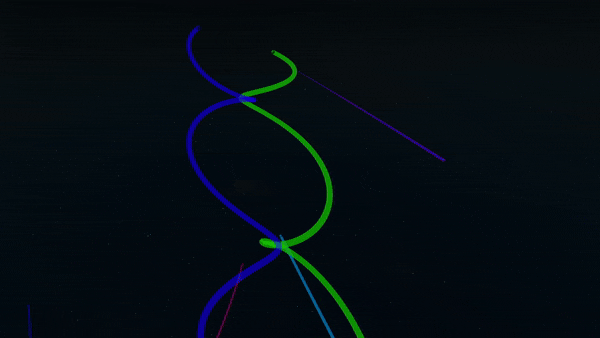

# N-Body vs Two-Body Simulations

## Our N-Body Universe

In our universe, every mass applies a gravitational force on every other mass. Its these interactions that form galaxies, stars, and planets. 

How might we simulate our n-body universe with code?

Using an iterative approach to roughly simulate an n-body system of gravitational bodies happens to be fairly trivial, and, to demonstrate, I made an open source demo less than an hour! Click the link to the Roblox game is [here](https://www.roblox.com/games/7194134563/N-Body-Gravity-Simulation), and the source code is [here](https://github.com/daftcube/RobloxNBodySim/blob/main/simulation.lua).

## The Trouble with the N-Body Problem

Despite how simple it is to implement an n-body simulation iteratively, things start to get much more complex if we want to do any sort of analytical modelling. The problem with our iterative simulation is that each step of the simulation requires the previous step to be calculated beforehand. In other words, **if we want to calculate the position of a planet after 450 steps (which is about 15 seconds of game time), we must calculate the previous 449 steps first.**

This makes it impossible to do any sort of prediction (“After some time t, what is the object’s position?”) or optimization (“What is the closest two objects get to one another over the first 6 seconds?”). Moreover, time acceleration in an interative simulation is problematic. Either we can increase the amount of time that elapses between each step, (which leads to large degrees of inaccuracy over time) or we can solve more steps in the same amount of time (which is very computationally expensive.)

If we want to make a game about flying spacecraft, being unable to predict movement in the future is, to put it lightly, **kind of an issue!**

What we’re looking for is a mathematical equation that we can use to model the motion of an object at any given time with a single independent calculation. Turns out, general solutions for the n-body problem have been discovered, however their complexity is comparable to the chaos we saw in our simple simulation. NASA uses supercomputers to solve these equations. We obviously don’t have that type of hardware, so we’ll need to find a simpler-but-adequate way to model orbital mechanics.

## OrbitLib and Two-Body Orbital Mechanics

Gravity is an inverse square law. This means that the effect of gravity from any given body decreases very quickly as distance increases.

If you watched the Roblox n-body demo, you might have noticed that some objects fly off into the distance and only contribute a negligible amount of gravity to the rest of the objects in the universe. What if we ignored these mostly irrelevant bodies to reduce the complexity of our simulation?

Enter: **The Two-Body Approximation.**

In a two body system, we ignore all sources of gravity and objects except for two: the “parent body,” and the object orbiting it. The parent body can be anything of significant mass: a star, planet, moon, or even comet. The orbiting object can also be anything, but it should be something with significantly less mass than the parent body. This simplification logically follows what we normally think of when we think of orbits: one small object circling around a much bigger one.

Ignoring all sources of gravity beyond the two bodies in our system tremendously simplifies our calculations.

This approximation is actually fairly good for most uses; before supercomputers were as fast as they are today, engineers at NASA used the two-body approximation (along with some math to compensate for "perturbations" from other gravity sources) to solve for interplanetary trajectories.

OrbitLib implements a two-body orbital mechanics simulation that is optimized, elegant, and powerful.