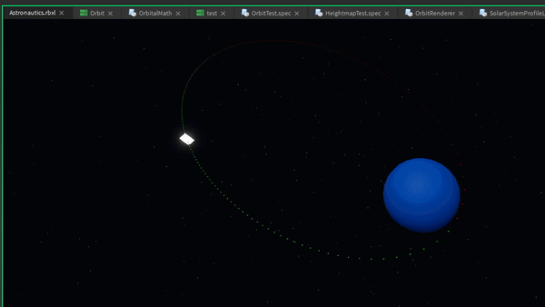
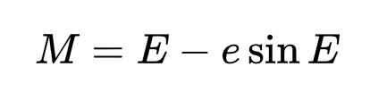
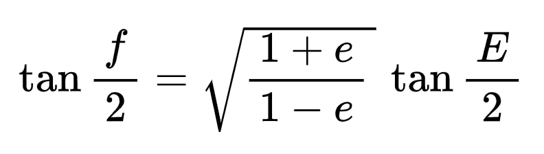

# Orbital Prediction

Given a spacecraft's initial orbital parameters, how can we calculate the position of the spacecraft at some future time? This is the **Orbital Prediction Problem.**



## The Math Behind Orbital Prediction

Kepler's Equation models the motion of objects in two-body orbits by relating three values using two:

- The True Anomaly (f) is the angular position of an object along its elliptical orbit, measured counterclockwise from the lowest point in the orbit.
- The Mean Anomaly (M) is the angular position along its orbit if that orbit was circular. Because we assume the orbit is circular, we can calculate the Mean Anomaly easily using a similar derivation to the one in the Circular Orbits section.
- The Eccentric Anomaly (E) is a special variable that relates the True Anomaly to the Eccentric Anomaly.

The Mean and Eccentric Anomaly are related as follows:

{ width="225" }

The True Anomaly and Eccentric Anomaly are related as follows:

{ width="225" }

However, if we try to solve Kepler's equation for the Eccentric Anomaly as a function of the Mean Anomaly, we discover that it is impossible. This is because Kepler's equation belongs to a family of functions called the [Transcendentals](https://en.wikipedia.org/wiki/Transcendental_function). This means that the Eccentric Anomaly cannot be represented as a finite sequence of algebraic operations. In other words, we cannot solve for E.

However, we can use numerical methods and calculus to approximate a solution. 

The following Desmos calculator provides a visualization of how the three anomalies are related and a brief summary of the Eccentric Anomaly can be approximated from the mean anomaly.

<iframe src="https://www.desmos.com/calculator/bbuqlanopw?embed" width="600" height="500" style="border: 1px solid #ccc" frameborder=0></iframe>

If you have further interest in the mathematics that goes into orbital prediction, this [Dev Blog](https://devforum.roblox.com/t/graphing-calculators-solving-algebraically-unsolvable-equations-orbital-mechanics-in-roblox-2/1462115) goes into more detail.

## OrbitLib's Orbital Prediction

If you experimented with the Desmos calculator, you may have noticed that the calculator gives incorrect values when the orbital eccentricity is high. To avoid this, OrbitLib implements the [Universal Variables Formulation](https://en.wikipedia.org/wiki/Universal_variable_formulation). This is a more complex derivation that uses change-of-variables to avoid the extreme behavior at high eccentricities while also extending the solution to parabolic and hyperbolic orbits.

OrbitLib provides the [`Orbit:UniversalPrediction(currentTime: number, tolerance: number)`](../API Reference/orbit.md#orbituniversalprediction) to approximate the solution to the Orbital Prediction problem. This function takes two inputs. The first one, `currentTime` (:material-ruler: s) is straightforward. But what is `tolerance`? 

As stated in the above section, there exists no exact solution to the Orbital Prediction problem. This function uses numerical analysis to approximate the solution. This means the algorithm starts with an educated guess, and then 'refines' the solution to be within a maximum amount of error from the actual solution. The `tolerance` is this maximum error (:material-ruler: km) between the actual answer and OrbitLib's numerical approximation.

Do note a lower `tolerance` gives a more accurate result at the cost of increased computation time.

This function returns the true anomaly (:material-ruler: rad) of the spacecraft at the given time. To find its position at the given time, feed the resultant true anomaly back into the [`Orbit:GetPositionVelocityECI(...)`](../API Reference/orbit#getpositionvelocityeci) method.

```lua title="Example Usage of Universal Prediction" linenums="1"
local TOLERANCE = 0.000008 -- Kilometers
local currentTime = 120

-- Calculate position along orbit within 0.000008 kilometers at 120 seconds
local trueAnomalyAt120Seconds = 
    orbit:UniversalPrediction(currentTime, TOLERANCE)

-- Get ECI position at 120 seconds from true anomaly at time
local eciXAt120Seconds, eciYAt120Seconds, eciZAt120Seconds = 
    orbit:GetPositionVelocityECI(trueAnomalyAt120Seconds)
```

## 