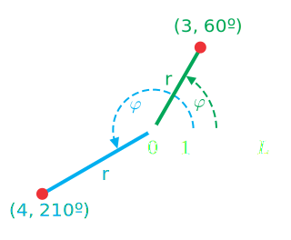
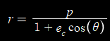
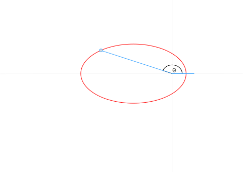

# Polar Coordinates

When looking at the [`GetPositionVelocityECI(...)`](../API Reference/) function, it might be a bit confusing to see that it takes an angle as an argument. However, if we understand how orbits are defined mathematically, it might make a bit more sense. But before we do that, let's review a type of coordinate system.

The **polar coordinate system** is a coordinate system where each coordinate is defined by an angle counterclockwise from the +x axis (also called the reference direction) and its distance (also called radius) from the origin. Consider the figure below:

Here, there are two points plotted: (3, 60 degrees) and (4, 210 degrees). As we can see, the angle determines the direction of the point, and the radius determines how far from the origin the point lies in that direction.

A **polar function** is a function that takes an angle as an input and outputs a distance from the origin. Just like we can define a "normal" (cartesian) function as y=f(x) that outputs a point (x,y), we can write a polar function as r=f(Θ) that outputs a point (r, Θ).

## Spacecraft Trajectories as Polar Functions

If we do physics to derive the shape of a spacecraft trajectory in a two-body system, we quickly discover that the shapes of two-body orbits are a class of geometric curves called conic sections:

How do we represent these shapes with mathematics? If we try to use Cartesian coordinates, we run into two issues. First, we need to use multiple functions to fit the conic sections. We can't represent the entire circle, ellipse, or hyperbola with a single function without violating the vertical line test. Thus, we need multiple functions to fully describe the shape of each curve. 

Second, describing a position along the curve is not intuitive. Because there is not a single function to represent the curve, we can't represent a position along the curve with a single value. Instead, we need to use an (x,y) pair.  

Turns out, it is much more elegant to represent these shapes using polar functions. By representing the orbit as a polar function, we can come up with a single equation that describes the orbit as a function of the angle from the +x direction:

...where Θ is the angle measured counterclockwise from the +x direction and the other variables have more complex derivations.

Feel free to explore the following Desmos demo to see a visualization of this trajectory function using polar coordinates:

<iframe src="https://www.desmos.com/calculator/vwtebcultl?embed" width="600" height="500" style="border: 1px solid #ccc" frameborder=0></iframe>

## Polar Coordinates to Describe Position Along Orbits

The most common way of describing a position along an orbit is by using polar coordinates.

We call the angle measured counterclockwise from the lowest point of the orbit (periapsis) to the position of the spacecraft the **True Anomaly.**

## Converting Between Polar and Cartesian Coordinates

We can convert polar coordinates to rectangular coordinates using the identities y=rsin(Θ) and x=rcos(Θ).

## Image Attributions

- Figure 1: Monsterman222, CC BY-SA 3.0 <https://creativecommons.org/licenses/by-sa/3.0>, via Wikimedia Commons. Modified to make black annotations white for contrast.
- Figure 2: JensVyff, CC BY-SA 4.0 <https://creativecommons.org/licenses/by-sa/4.0>, via Wikimedia Commons
- Figure 3: No machine-readable author provided. Mets501 assumed (based on copyright claims), CC BY-SA 3.0 <http://creativecommons.org/licenses/by-sa/3.0/>, via Wikimedia Commons. Modified to make black annotations white for contrast.