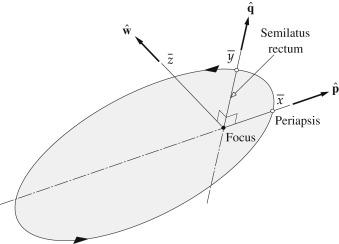
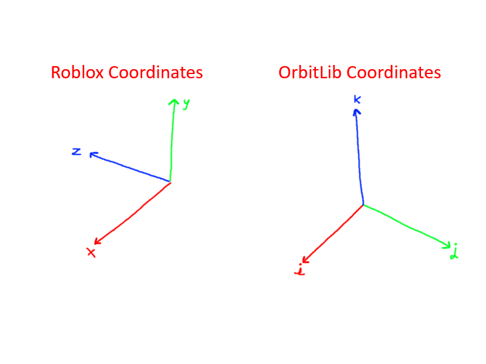

## Earth-Centered Inertial (ECI) Coordinates

The Earth-Centered Inertial (ECI) coordinate system is a coordinate system that places Earth at the origin. The y-axis goes through the north pole. The x-axis is defined as pointing directly towards the sun during the [vernal equinox](https://en.wikipedia.org/wiki/March_equinox). The z-axis is the cross product between these vectors.


The reference frame is non-inertial, meaning the axes do not rotate with the planet. Instead, they remain pointing in their respective fixed directions.

When working with bodies that are not Earth, OrbitLib calls all coordinates relative to a coordinate system with the y-axis going through the planetary pole and the x-axis going in an arbitrary perpendicular direction as 'ECI' coordinates.

Also note that the reference vectors for ECI coordinates are sometimes called I, J, K instead of X, Y, Z.

## Perifocal Coordinates

Where ECI coordinates are relative to the planet, Perifocal coordinates are relative to a particular orbit. The x-axis points towards the point of the orbit closest to the planet. The y-axis points in a direction 90 degrees counterclockwise from the x-axis in the plane of the orbit. The z-axis is the cross product of these vectors.



Also note that the reference vectors for Perifocal coordinates are sometimes called P, Q, W instead of X, Y, Z.

## OrbitLib Reference Vectors vs Roblox Reference Vectors

OrbitLib was built to be as close to common aerospace conventions as possible. In astrodynamics, the coordinate system used has a different set of reference unit vectors.



Luckily, these differences in coordinate systems can be easily corrected using a simple matrix change-of-coordinates like so:

```lua title="Conversion Examples"
-- Convert from Roblox coordinates to OrbitLib coordinates.
function RobloxToOrbitLib(x: number, y: number, z: number)
    return x, -z, y
end

-- Convert from OrbitLib coordinates to Roblox Coordinates.
function OrbitLibToRoblox(i: number, j: number, k: number)
    return i, k, -j
end
```