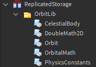

# Quickstart

Welcome to OrbitLib! This quickstart aims to provide everything needed to start using OrbitLib at a basic level.

## Features

OrbitLib is a library that brings Keplerian orbital mechanics to Roblox.

Its features include:

- Basic Orbital Properties
- Orbital Derivation from Position and Velocity
- Orbital Prediction over Time
- Utilities for Rendering

## Installation

Let's open Roblox Studio and create an empty project on a baseplate.

Next, follow the instructions on the [Installation Page](./installation.md) and return here once done. For the sake of the quickstart guide, let's **install OrbitLib into ReplicatedStorage**. Once done, your ReplicatedStorage should look something like this:



## Units

Before we continue to writing code, let's talk about units.

In physics, units are very important. We can get _very different_ answers to problems if we use even a different scale of the same unit (kilometers vs meters). Thus, it is important to keep track of what units are being used at all times.

The OrbitLib documentation helps you keep track of what units functions expect and return using the ruler (:material-ruler:) icon. If you see this icon in the documentation, that means the function/field/variable/whatever uses those types of units. 

## Hello OrbitLib!

Now that OrbitLib is installed, let's take it for a test drive. Let's write some code that creates Earth and a satellite orbiting it.

Create a new script in `ServerScriptService` and name it `HelloOrbitLib`.

On the first lines, let's import the CelestialBody class and Orbit class from their respective module scripts:

```lua title="Importing the Modules"
-- Import modules from OrbitLib
local CelestialBody = require(game.ReplicatedStorage.OrbitLib.CelestialBody)
local Orbit = require(game.ReplicatedStorage.OrbitLib.Orbit)
```

Now, let's create Earth using [`CelestialBody.new(...)`](./API Reference/celestialBody.md#constructors). The constructor expects a `string` name as the first argument, the mass of the planet (:material-ruler: kg), and the radius of the planet (:material-ruler: km).

```lua title="Importing the Modules"
-- Create Earth, a CelestialBody with a mass of 5.972*10^24 kg 
-- and a radius of 6378.1 kilometers
local earth = CelestialBody.new("Earth", 5.972e24, 6378.1)
```

Great, we now have a properly configured CelestialBody. Let's make an orbit around it. 

[Keplerian elements](https://en.wikipedia.org/wiki/Orbital_elements) are a common way to describe the shape of orbits. Using the [`Orbit.fromKeplerianElements(...)`](./API Reference/orbit.md#fromkeplerianelements) constructor, we can create an orbit using common Keplerian elements.

Let's make an orbit around the equator of the planet at an altitude of about 1700 kilometers above the surface. The orbital parameters for such an orbit would be as follows:

| Orbital Parameter                   | Value |
|-------------------------------------|-------|
| Semimajor Axis (a)                  | 8000  |
| Eccentricity (e)                    | 0     |
| Inclination (i)                     | 0     |
| Longitude of the Ascending Node (Ω) | 0     |
| Argument of the Periapsis (ω)       | 0     |
| True Anomaly (v)                    | 0     |

```lua title="From Keplerian Elements"

```


```lua title="Hello OrbitLib!"

print("Hello OrbitLib!")

-- Import modules from OrbitLib
local CelestialBody = require(game.ReplicatedStorage.OrbitLib.CelestialBody)
local Orbit = require(game.ReplicatedStorage.OrbitLib.Orbit)

-- Create Earth, a CelestialBody with a mass of 5.972*10^24 kg 
-- and a radius of 6378.1 kilometers
local earth = CelestialBody.new("Earth", 5.972e24, 6378.1)

-- Create a circular orbit about 1700 kilometers above the surface.
local orbitTest = Orbit.fromKeplerianElements(
	earth, 0, 8000, 0, 0, 0, 0, 0
)

print(orbitTest)
```